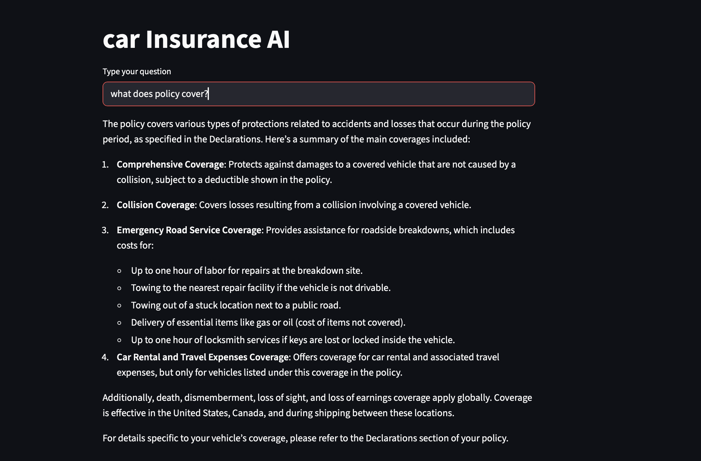

# RAG Web App

This project is a small Retrieval-Augmented Generation (RAG) web app built with Streamlit and LangChain. Using RAG can reduce hallucinations by grounding responses in retrieved source text. It answers questions about a car insurance policy by retrieving relevant text from a PDF and using an LLM to respond strictly from that context.



## What it does
- Loads `Statefarm.pdf`
- Splits the document into chunks
- Creates embeddings and stores them in a FAISS vector index
- Retrieves the most relevant chunks for a user question
- Sends the question and retrieved context to an LLM
- Displays a response in a Streamlit UI

## RAG pipeline
1. Document loading: `PyPDFLoader` reads `Statefarm.pdf`.
2. Chunking: `RecursiveCharacterTextSplitter` splits the document into overlapping chunks for better retrieval.
3. Embeddings: `OpenAIEmbeddings` generates vector embeddings for each chunk.
4. Vector store: `FAISS` stores embeddings and supports similarity search.
5. Retrieval: The retriever fetches the most relevant chunks for the user query.
6. Generation: `ChatOpenAI` answers using a system prompt that enforces strict reliance on retrieved context.

## Requirements
- Python 3.10+
- An OpenAI API key
- Dependencies listed in `requirements.txt`

## Setup
1. Create and activate a virtual environment.
2. Install dependencies:
   ```bash
   pip install -r requirements.txt
   ```
3. Set your OpenAI API key:
   ```bash
   export OPENAI_API_KEY="your-key"
   ```

## Run the app
```bash
streamlit run Rag_Web.py
```

## Files
- `Rag_Web.py`: Streamlit app and RAG pipeline code.
- `Statefarm.pdf`: Source document for retrieval.
- `requirements.txt`: Python dependencies.
- `*.ipynb`: Notebooks used for experimentation.

## Notes
- The app strictly answers using the retrieved context. If the answer is not in the document, it tells the user to contact customer service.
- Large virtual environments should stay out of Git history. Keep `venv/` ignored in `.gitignore`.
